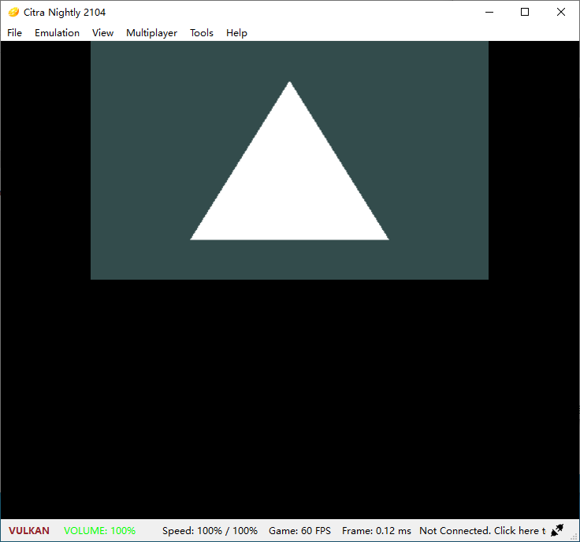

# 3DS_helloworld

A basic 3DS app

# config devkitPro

1. Just follow https://devkitpro.org/wiki/Getting_Started
2. (windows only) run devkitPro msys2

# Referencs
- https://devkitpro.org/wiki/Getting_Started
- https://github.com/devkitPro/wii-examples
- [citra-emulator](https://citra-emulator.com/)
